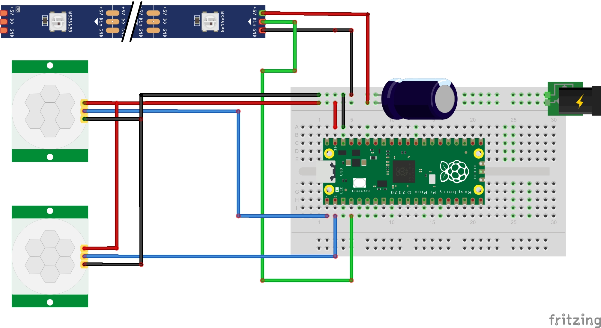

# StairLights
Motion sensitive LED light strip for stairwell illumination.

## Hardware List
 - [Adafruit NeoPixel Digital RGB LED Strip 60 LED 2m](https://www.adafruit.com/product/2540)
 - [Raspberry Pi Pico W](https://www.adafruit.com/product/5526) (In its current form this project doesn't take advantage of the wireless chip but all pin selections are made with the limitations of the W in mind)
 - 2x [PIR Motion Sensors](https://www.adafruit.com/product/189)
 - [Perf board](https://www.adafruit.com/product/1609)
 - [Socket Headers](https://www.adafruit.com/product/5583)
 - [5V 10A power supply](https://www.adafruit.com/product/658)
 - 1000uF capacitor
 - Aluminum LED strip channel and diffuser
 - TBD: exact wire and connectors
 
 ### Diagram
 
 
 ## Software
 - [MicroPython](https://micropython.org/download/RPI_PICO_W/)
 - [Thonny](https://thonny.org/)
 
